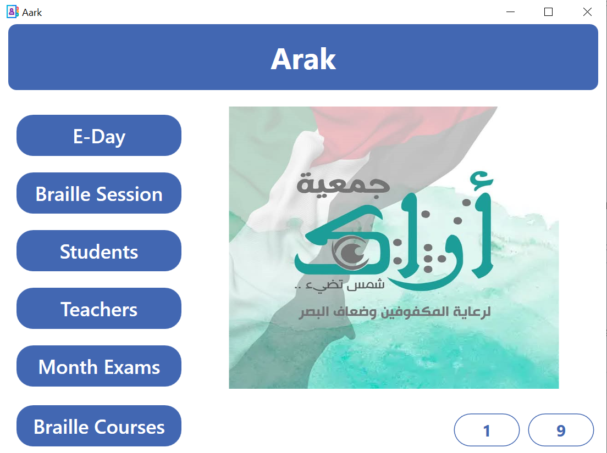
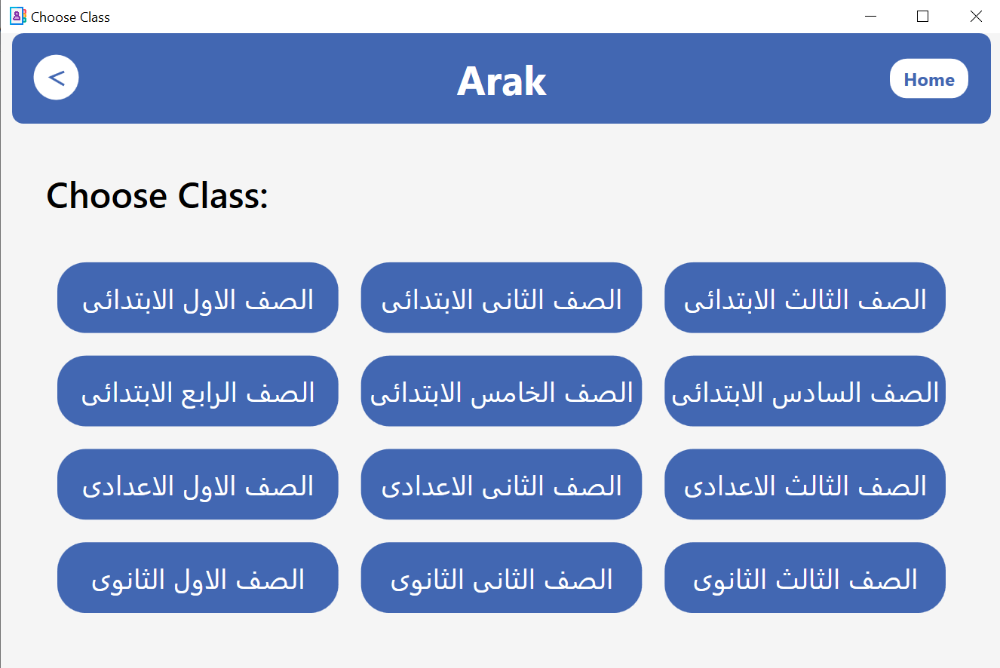
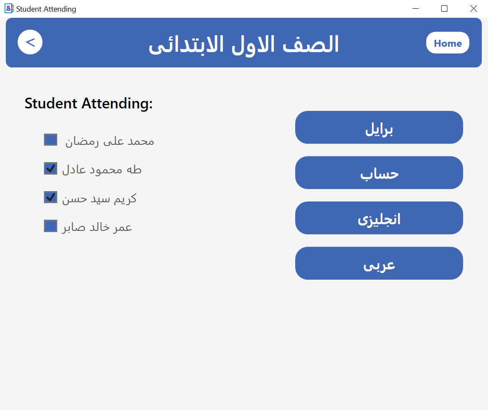
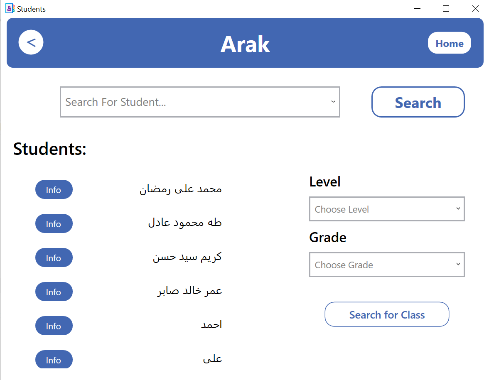
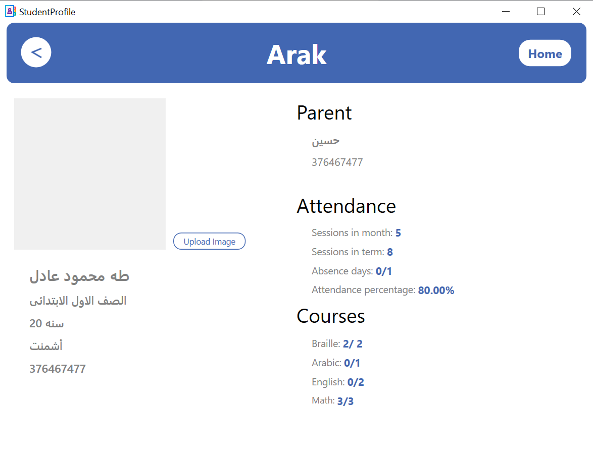
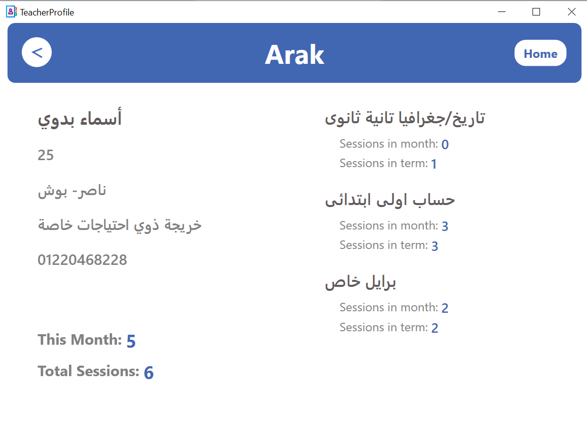
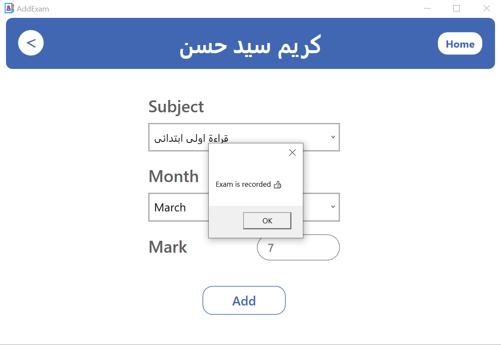
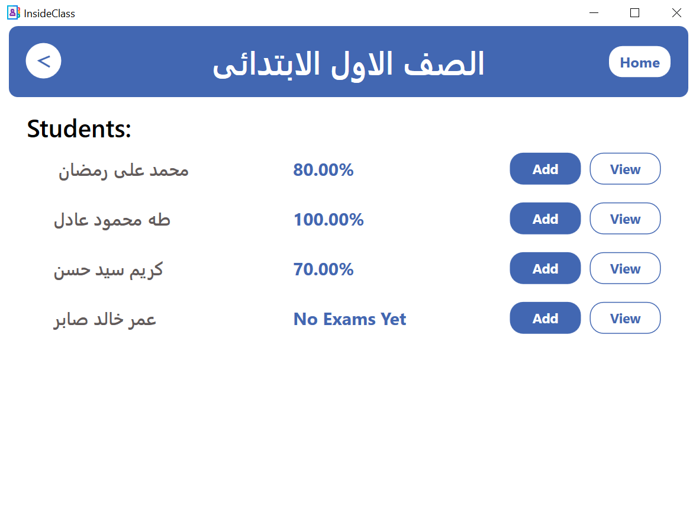

# Arak – Education Management System (WPF)

Arak is a **desktop management system built with WPF** for a charity organization that supports **visually impaired students**. The system is designed to manage educational activities such as classes, attendance, exams, and performance tracking in a clear and structured way.

The project was developed to help the organization digitally track lessons, students, and teachers, and to generate meaningful insights about attendance and academic performance.

---

---

## Project Purpose

The main goal of **Arak** is to simplify and automate the daily academic operations of the organization, including:

* Tracking all lessons conducted
* Monitoring student attendance and absences
* Evaluating student performance in monthly exams
* Analyzing teacher activity and workload

---

## Features

### Lesson Management

* Register and store **all lessons** conducted by the organization
* Track lessons by:

  * Month
  * Term
  * Subject
  * Grade
  * Teacher

---

### Student Tracking

* View how many lessons each student attended:

  * Per **month**
  * Per **term**
* Track lesson count **per subject** for each student
* Calculate and display:

  * Attendance percentage
  * Absence percentage
* Monitor student engagement across different subjects

---

### Exam & Performance Management

* Record **monthly exams** for students
* Track student performance across:

  * Individual exams
  * Overall exam averages
* Evaluate the academic level of each student based on cumulative results

---

### Teacher Activity Tracking

* Track how many lessons each teacher has given:

  * Per month
  * Per term
* Filter teacher lessons by:

  * Subject
  * Grade
* Provide a clear overview of teacher workload and activity

---

### Reports & Insights

* Monthly and term-based statistics
* Student attendance and performance summaries
* Teacher activity summaries
* Subject-based lesson analytics

---

## Technologies Used

* **C#**
* **WPF (.NET)**
* **Entity Framework / Database** 

---

## System Scope

The system is designed to be used internally by the organization’s staff to:

* Manage students and teachers
* Track lessons and exams
* Generate clear statistics to support decision-making

Communication between students and teachers happens **outside the system**; Arak focuses purely on management and analytics.

---

## 🚀 Future Enhancements

Possible improvements for future versions:

* Advanced reporting and export (PDF / Excel)
* Role-based access (Admin / Teacher)
* Improved UI accessibility features
* Cloud database support

---
## Contributing

Contributions are welcome! Please feel free to submit a Pull Request.

---

## Contact

For any questions or suggestions, please reach out to [mo7ammeda7medabdelmoneim@gmail.com](mailto:your-email@example.com)

---

## Some APP Screens

